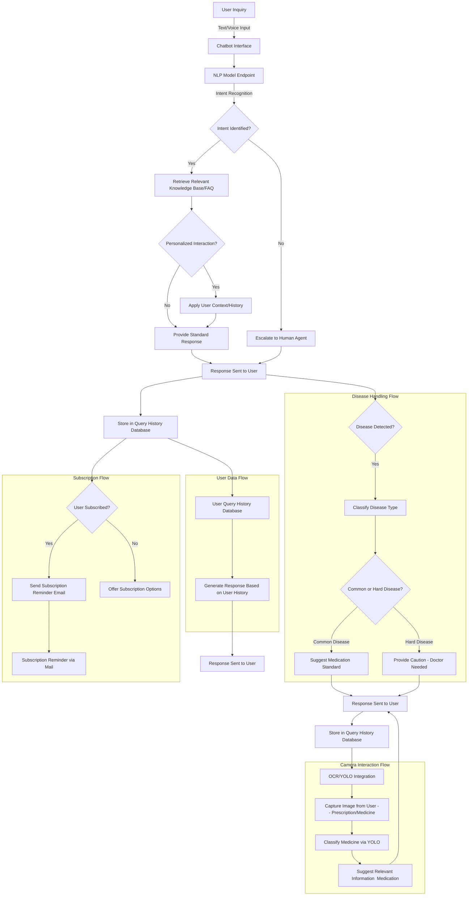

# LLM-Kshitij

```mermaid

graph TD
    A[User Inquiry] -->|Text/Voice Input| B[Chatbot Interface]
    B --> C[NLP Model Endpoint]
    C -->|Intent Recognition| D{Intent Identified?}
    D -->|Yes| E[Retrieve Relevant Knowledge Base/FAQ]
    D -->|No| F[Escalate to Human Agent]
    
    E --> G{Personalized Interaction?}
    G -->|Yes| H[Apply User Context/History]
    G -->|No| I[Provide Standard Response]
    H --> I
    I --> J[Response Sent to User]
    J --> K[Store in Query History Database]
    
    K --> L[User Query History Database]
    L --> M[Generate Response Based on User History]

    M --> N[Response Sent to User]
    
    K --> O{User Subscribed?}
    O -->|Yes| P[Send Subscription Reminder Email]
    P --> Q[Subscription Reminder via Mail]
    
    O -->|No| R[Offer Subscription Options]
    
    J --> S{Disease Detected?}
    S -->|Yes| T[Classify Disease Type]
    T --> U{Common or Hard Disease?}
    U -->|Common Disease| V[Suggest Medication  Standard ]
    U -->|Hard Disease| W[Provide Caution - Doctor Needed]
    V --> X[Response Sent to User]
    W --> X
    X --> Y[Store in Query History Database]

    Y --> Z[OCR/YOLO Integration]
    Z --> AA[Capture Image from User -- Prescription/Medicine]
    AA --> AB[Classify Medicine via YOLO]
    AB --> AC[Suggest Relevant Information  Medication ]
    AC --> X

    F --> J

    subgraph User Data Flow
        L
        M
    end
    subgraph Disease Handling Flow
        S
        T
        U
        V
        W
    end
    subgraph Camera Interaction Flow
        Z
        AA
        AB
        AC
    end
    subgraph Subscription Flow
        O
        P
        Q
        R
    end

```
